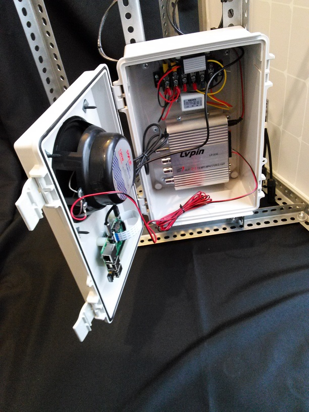
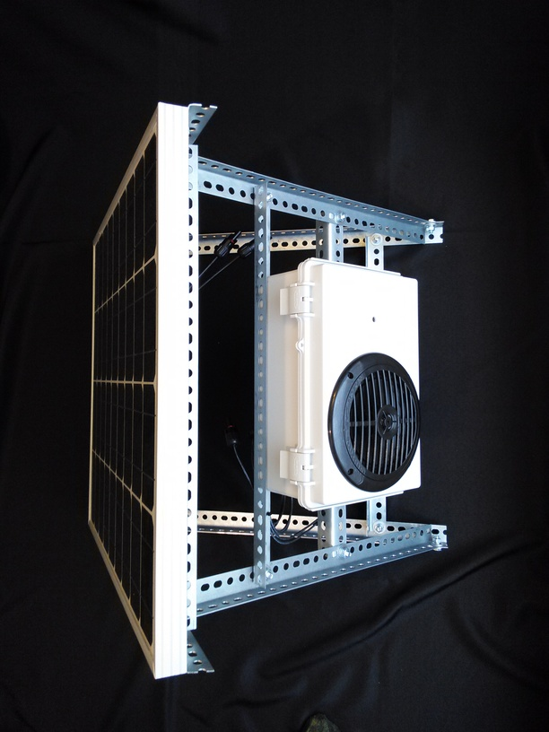
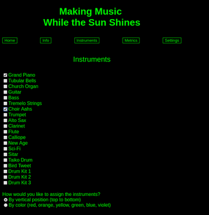
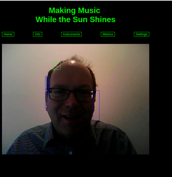

# Overview

Making Music While the Sun Shines is an experiment in music composition and performance. It converts a participant's motion into music. It was developed as in art installation for the 4Culture Tech Specific program in Seattle. 4Culture is the Cultural Development Authority of King County.

http://www.4culture.org/

# Implementation

Making Music is a Java based web application that runs on any system that has native versions of OpenCV and FluidSynth. As an art installation, Making Music features a solar panel, Raspberry Pi single board computer, camera, amplifier and speaker.

It features a WiFi hot spot that lets participants connect to it from their phone to view the images and change parameters, such as the selected instrument.

# Technical Details

Making Music takes a picture eight times a second and analyzes it for motion. It then converts the horizontal position of the motion into notes in a four octave range, with low notes on the left and high notes on the right.

Next, it uses the vertical position (or the color) of the motion to assign an instrument from Grand Piano to Drum Kit 3. The Instruments tab lets you select the instruments you'd like to hear as well as how to assign the instruments.

Finally, it synthesizes the sound associated with each note and instrument and plays the sounds through the amplifier and speaker. It's then ready to take the next picture and repeat the process.

